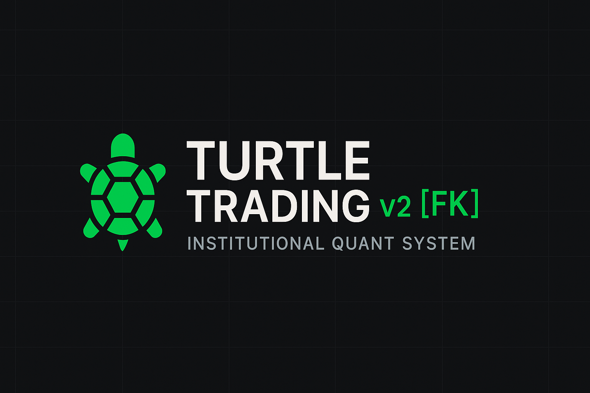

# 🐢 Turtle Trading v2 — Rebalanced Long & Short [FK]

**Autor:** Fernando Cuéllar — *KuellarFer Labs*  
**Versión:** 2.1 • Octubre 2025  
**Licencia:** MPL 2.0  
**Documento de referencia:** [📘 Manual de Usuario Técnico (ManualUsuario.md)](ManualUsusario.md)

**Parametros de referencia:** [Parametros de Referencia(Parametros).](Parametros_TP_SL.md)

**Codigo:** [Codigo PineScript V6.0](TurtleTradingV2RebalancedLongShort.pine)

## 🎓 Introducción

El presente documento constituye la exposición técnica e institucional del sistema **Turtle Trading v2 — Rebalanced Long & Short [FK]**, una reinterpretación moderna del legendario método de *Richard Dennis* y *William Eckhardt*, originalmente concebido en la década de los ochenta para demostrar que la rentabilidad sistemática puede ser enseñada, medida y replicada.

Esta versión fue desarrollada en **Pine Script v6**, extendiendo los principios clásicos de **seguimiento de tendencia** y **gestión de riesgo mediante volatilidad (ATR)**, con un enfoque cuantitativo orientado a la **optimización adaptativa y antifrágil** de las operaciones.

Su propósito no es solo replicar la estrategia, sino **reconstruirla con precisión institucional**, integrando prácticas modernas de **riesgo dinámico**, **piramidación controlada**, **validación sin sesgo (no look-ahead)** y **entornos visuales para auditoría en tiempo real**.

---

## 🧩 Fundamentos Cuantitativos

### 1. Naturaleza del Sistema

**Turtle v2 [FK]** es un sistema **trend-following discrecional cuantitativo**, diseñado bajo los siguientes principios:

- **No predicción**, solo respuesta a rupturas estructurales.  
- **Gestión de riesgo porcentual**, no nominal.  
- **Rendimientos escalonados**, mediante piramidación sucesiva (adds).  
- **Disciplina algorítmica**, para eliminar la interferencia emocional.  

A nivel matemático, el sistema se basa en:

  

donde \(L\) corresponde a 20 o 55 períodos según la condición de la **última operación (loss/win)**, siguiendo el principio original de Dennis: *“Reduce la sensibilidad tras una pérdida, expande la exposición tras una ganancia.”*

---

### 2. Arquitectura General

El sistema se compone de siete capas funcionales:

| Capa | Descripción | Objetivo técnico |
|------|--------------|------------------|
| 1️⃣ Inputs | Parámetros operativos, riesgo y filtros | Control granular de ejecución |
| 2️⃣ Contexto | Fecha, sesión y MA200 | Validación de régimen y liquidez |
| 3️⃣ Donchian | Breakouts sin look-ahead | Eliminación de sesgo temporal |
| 4️⃣ ATR / Sizing | Riesgo dinámico (N) | Constancia de exposición monetaria |
| 5️⃣ Señales | Validación de 4 reglas | Confirmación institucional |
| 6️⃣ Piramidación | Adds por múltiplos de N | Escalamiento antifrágil |
| 7️⃣ Visualización | HUD, semáforo, alertas | Auditoría y transparencia operativa |

---

## ⚙️ Diseño Algorítmico

### 🔹 Regla 20/55 Condicional
El sistema ajusta su sensibilidad según el desempeño de la operación previa:
- Si la última operación fue **pérdida**, se usa **20 días** (más reactivo).
- Si fue **ganancia**, se usa **55 días** (más conservador).

Este comportamiento genera **asimetría adaptativa** que suaviza drawdowns y estabiliza la varianza de retorno.

---

### 🔹 Gestión de Riesgo Cuantitativa

El tamaño de posición se determina mediante:

  

donde:
- \(A\) es el capital base o nominal,
- \(r\) el porcentaje de riesgo por trade,
- \(ATR\) la volatilidad media (N-periodos),
- \(k\) el múltiplo de stop (ej. 2.5).

De esta forma, **todas las posiciones arriesgan el mismo monto en dólares**, independientemente del activo o su volatilidad relativa, asegurando neutralidad estadística.

---

### 🔹 Entradas y Salidas
Las **órdenes stop** se colocan en los límites Donchian (sin look-ahead), garantizando que toda entrada provenga de una ruptura **confirmada por precio**.  
Las salidas combinan dos mecanismos:
1. **Stop inicial**: basado en `stopMultN × N`
2. **Trailing Donchian 10 días**: dinámico y sensible al régimen

El sistema toma el **máximo (long)** o **mínimo (short)** entre ambos stops, asegurando **protección constante del capital** sin sobreajustar.

---

### 🔹 Piramidación Antifrágil

El sistema emplea una lógica de **piramidación progresiva** cada vez que el precio se mueve `addStepN × N` a favor.  
Cada add es tratado como una unidad independiente, con tamaño constante y riesgo indirectamente decreciente por volatilidad residual.

Esto replica la estructura original de los Turtles, pero adaptada a ejecución algorítmica moderna: controlada, auditable y replicable en múltiples activos.

---

## 🧠 Filtros, Señales y Regímenes de Mercado

La **entrada institucional** solo se habilita si se cumplen las cuatro reglas simultáneamente:

1. **Contexto** — La operación ocurre dentro de la fecha y sesión válida.  
2. **Tendencia** — Confirmada por `MA200` (si está activa).  
3. **Señal** — Ruptura válida en Donchian sin sesgo.  
4. **Ejecución OK** — Lotes, riesgo y tamaño válidos (`qtyPerUnit > 0`).  

El conjunto de estas condiciones genera el “**OK Long/OK Short Scanner**”, utilizado para identificar pares en fase operativa dentro de un **entorno multi-asset**.

---

## 📊 Visualización y Auditoría

El sistema integra un **HUD cuantitativo** que muestra:

- ATR actual (N)
- Stop y Add en múltiplos de N
- Nº de unidades abiertas
- Lotes reales (redondeo por `qtyStep`)
- Estado del régimen (20/55)
- Indicadores `OK Long` / `OK Short`
- Semáforo dinámico (contexto, tendencia, señal, validación)

Adicionalmente, un **tinte de fondo** colorea el gráfico de acuerdo a la dirección activa, permitiendo **auditoría visual inmediata** en entornos de backtest y forward test.

---

## 💾 Backtesting Institucional

Para análisis cuantitativo robusto:

| Configuración | Recomendación |
|----------------|----------------|
| `calc_on_every_tick` | `true` (simula microestructura) |
| `commission_type` | Percent-based (ej. 0.05%) |
| `slippage` | 0.5–1.0 ticks |
| `initial_capital` | ≥ 10,000 USD |
| `risk_pct` | 0.5–1.0% por trade |

**Recomendación:** los resultados deben **validarse mediante simulaciones Monte Carlo** y análisis de estabilidad paramétrica, siguiendo la filosofía de antifragilidad de Taleb.

---

## 📘 Documentación Técnica

> Para una descripción detallada de cada bloque de código, variable y lógica de ejecución, consulte el documento oficial:

🔗 **[Manual de Usuario Técnico — Turtle Trading v2 (ManualUsuario.md)](ManualUsusario.md)**

Incluye:
- Explicación línea por línea  
- Diagramas de flujo  
- Casos de backtest  
- Ejemplos multi-par  
- Guía de scanner  
- Resolución de errores comunes  

---

## 📈 Aplicaciones Institucionales

El sistema puede integrarse como:

- **Módulo cuantitativo** en portafolios multi-asset (Crypto, Forex, Commodities).  
- **Base experimental** para modelos RL (*Reinforcement Learning*) de gestión adaptativa.  
- **Motor de señales** en dashboards de TradingView, n8n o Grafana mediante API.  
- **Componente educativo** en programas de maestría o certificaciones financieras.

---

## 🧮 Ejemplo de Configuración (BTCUSDT 1D)

| Parámetro | Valor | Descripción |
|-----------|------:|-------------|
| ATR Len | 25 | Longitud media de volatilidad |
| Stop Mult N | 2.5 | Multiplicador de stop inicial |
| Add Step N | 0.75 | Escalón de piramidación |
| Risk % | 0.5 | Exposición por operación |
| MA Filter | ON | Confirma tendencia dominante |

---

## 🔬 Conclusiones

El rediseño **Turtle Trading v2 [FK]** no solo preserva el legado de la metodología original, sino que lo proyecta hacia un entorno **moderno, cuantitativo y antifrágil**.

Su implementación en Pine Script® ofrece **transparencia, reproducibilidad y modularidad**, pilares fundamentales para la ingeniería financiera contemporánea.  

Más allá del trading, este proyecto es un **ejercicio académico de diseño de sistemas adaptativos**: un puente entre la historia del trading sistemático y la arquitectura algorítmica moderna.

---

## 🧭 Referencias

- Dennis, R. & Eckhardt, W. *The Turtle Experiment* (1983).  
- Kaufman, P. *Trading Systems and Methods*, Wiley.  
- Taleb, N.N. *Antifragile: Things That Gain from Disorder*, Random House.  
- Glasserman, P. *Monte Carlo Methods in Financial Engineering*.  
- Wyckoff, R. *Stock Market Technique* (1930).  

---

## 🧠 Autor

**Fernando Cuéllar**  
*Ingeniero, Data Scientist & Quantitative Developer*  
📍 Chihuahua, México  
📧 [kuellarfer@gmail.com](mailto:kuellarfer@gmail.com)  
🌐 [GitHub: ferkuellar](https://github.com/ferkuellar)

---

> *“La robustez se defiende del caos.  
La antifragilidad lo utiliza.”* — Nassim Nicholas Taleb

